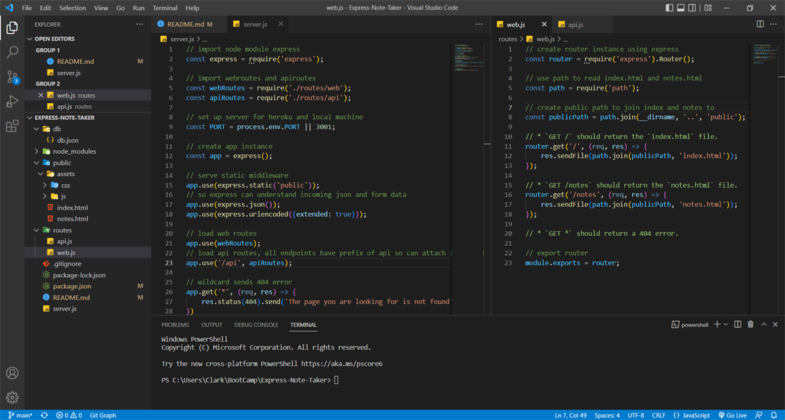
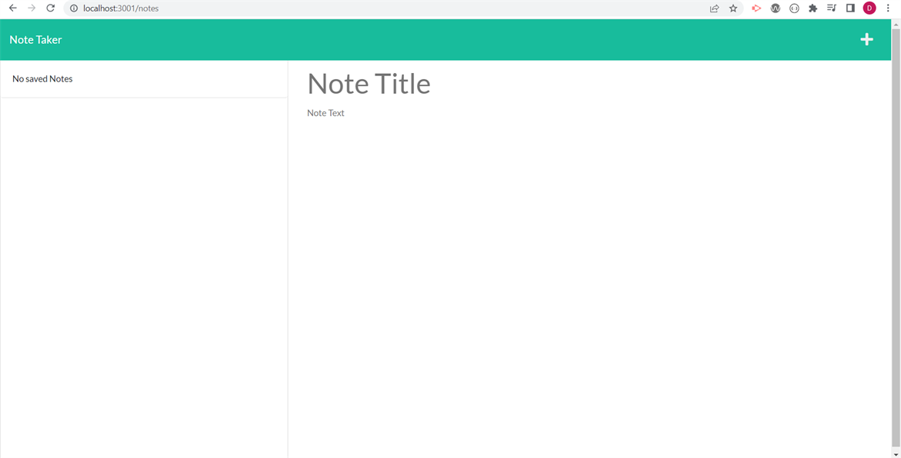
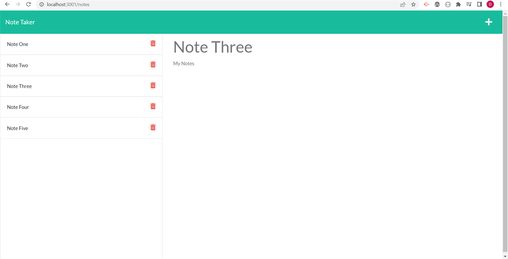

# Express Note Taker

  
## Table of Contents
1. [Description](#description)
2. [Key Points](#key-points)
3. [Skills Used](#skills-used)
4. [Note Taker Visuals](#note-taker-visuals)
5. [Things To Work On](#things-i-want-to-work-on)
6. [Repository and Live App](#links-to-repository-and-deployed-application)
  
## Description

Connected the front end to the back end of a note taker application in which the front end has already been designed and supplied.

## Key Points

When working as part of a team on a medium sized application such as this, it is more than likely you will not be building the entire code yourself, but be a cog in the team. In this circumstance we take on the role of the back end developer to connect to supplied application from the front end devs to an express server for deployment.

## Skills Used

As with all applications of this nature, after running npm init to create a package.json file, we create a server.js file in our root directory to build our express server around.

After importing express and creating an app instance, setting up the PORT for our local machine or heroku, the static middleware in the public folder is served. Now we can listen to the PORT on our local host and provides us the ability to test our application via live server or Insomnia.

Using a proper file structure, a routes folder is created to then add router instances initally for web.js to load our html pages provided, and then api.js to take care of our GET and POST requests. UUID is used to create unique id's on saved notes.

## Note Taker Visuals

Server Setup

Empty Notes

Example Notes

## Things i want to work on

Memorising some of the more repetitive things of setting up an express server instead of relying on referencing class material to become a faster and more versatile developer.

Understanding the ins and outs of Insomnia to more so test GET and POST requests to rely less on VS Codes live server. Not only this but also getting more familiar with Heroku and deploying applications on there as have become so familiar with Github after the last few months.

## Links to Repository and Deployed Application

- Repository - [Clarky's Repo](https://github.com/Clarky117/Express-Note-Taker)
- Live App - [Heroku](https://clarkys-express-note-taker.herokuapp.com/)
